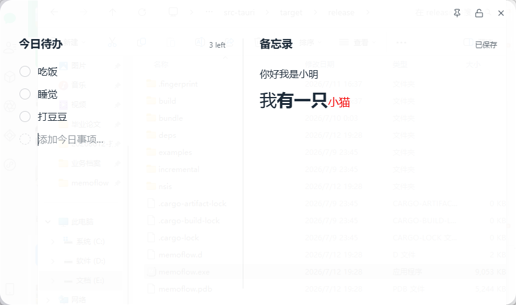

# MemoFlow

> 一个基于 Tauri 2 + Vue 3 开发的轻量级 Windows 桌面备忘录软件。

MemoFlow 面向需要常驻桌面、快速记录、轻量管理当天事项的用户。它将今日待办和备忘录放在一个简洁的悬浮窗口中，支持本地自动保存、系统托盘、窗口置顶、编辑锁定和基础富文本编辑，适合作为日常工作中的小型信息收纳面板。

## 项目简介

MemoFlow 的设计目标是：启动快、占用低、界面安静、操作直接。相比完整的笔记软件，它更关注桌面侧边常驻场景；相比普通便签，它提供了待办、备忘录、富文本、窗口状态恢复和托盘驻留等更完整的桌面体验。

适合这些场景：

- 每天快速记录待办事项
- 临时保存会议、开发、学习中的零散文本
- 将小型备忘窗口悬浮在桌面一角
- 在不依赖云服务的情况下使用本地 JSON 数据保存

## 功能介绍

- 今日待办：支持新增、编辑、完成、删除
- 完成状态：圆形勾选图标，完成后文本自动弱化并添加删除线
- 备忘录：支持多行富文本编辑
- 富文本工具栏：支持加粗、字号选择、字号增减、文字颜色
- 字号选择：支持 12、14、16、18、20、22、24、28、32px
- 主题模式：支持浅色、深色、跟随系统
- 桌面悬浮：支持窗口置顶
- 编辑锁定：锁定后禁止编辑、拖动、关闭和富文本工具栏操作
- 系统托盘：关闭窗口后隐藏到托盘，可从托盘恢复或退出
- 单实例运行：重复启动时聚焦已有窗口
- 窗口状态恢复：保存窗口位置和尺寸
- 边缘吸附：窗口拖动到屏幕边缘时自动吸附
- 自动保存：待办、备忘录和设置会自动写入本地 JSON 文件
- 浏览器开发降级：前端开发环境下使用 localStorage 作为存储 fallback

## 项目截图

> 截图待补充。




## 技术栈

前端：

- Vue 3
- TypeScript
- Vite
- Pinia
- UnoCSS
- Motion
- Lucide Icons

桌面端：

- Rust
- Tauri 2
- Serde / serde_json
- Tauri Window State Plugin
- Tauri Single Instance Plugin
- Tauri System Tray
- NSIS Installer

## 项目结构

```text
MemoFlow
├── data/                       # 开发环境默认 JSON 数据
├── src/                        # 前端源码
│   ├── components/             # 通用与业务组件
│   │   ├── Checkbox/           # 待办圆形勾选组件
│   │   ├── GlassCard/          # 玻璃容器组件
│   │   ├── MemoPanel/          # 备忘录面板
│   │   ├── RichTextToolbar/    # 富文本浮动工具栏
│   │   ├── SaveToast/          # 保存提示
│   │   ├── TodoPanel/          # 今日待办面板
│   │   └── WindowBar/          # 自定义窗口栏
│   ├── pages/                  # 页面级组件
│   ├── store/                  # Pinia 状态管理
│   ├── styles/                 # 全局样式与主题变量
│   ├── types/                  # TypeScript 类型定义
│   └── utils/                  # 存储、窗口、富文本、主题等工具
├── src-tauri/                  # Tauri / Rust 桌面端工程
│   ├── capabilities/           # Tauri 权限能力配置
│   ├── icons/                  # 应用图标
│   ├── src/                    # Rust 入口、命令、托盘和窗口逻辑
│   ├── Cargo.toml              # Rust 依赖与包信息
│   └── tauri.conf.json         # Tauri 应用与打包配置
├── index.html                  # Vite HTML 入口
├── package.json                # 前端依赖与脚本
├── tsconfig.json               # TypeScript 配置
├── vite.config.ts              # Vite 配置
├── uno.config.ts               # UnoCSS 配置
├── LICENSE                     # MIT License
└── README.md
```

## 开发环境

建议环境：

- Windows 10/11
- Node.js 20 或更高版本
- npm 10 或更高版本
- Rust stable
- Cargo
- Microsoft C++ Build Tools / Visual Studio Build Tools
- WebView2 Runtime

检查环境：

```bash
node -v
npm -v
rustc -V
cargo -V
```

## 本地运行

安装依赖：

```bash
npm install
```

仅运行前端开发服务器：

```bash
npm run dev
```

浏览器访问：

```text
http://127.0.0.1:1420/
```

运行桌面开发版本：

```bash
npm run tauri:dev
```

## 构建项目

构建前端：

```bash
npm run build
```

构建 Tauri 桌面应用和安装包：

```bash
npm run tauri:build
```

构建产物位置：

```text
src-tauri/target/release/memoflow.exe
src-tauri/target/release/bundle/nsis/MemoFlow_0.1.0_x64-setup.exe
```

## 打包安装包

MemoFlow 使用 Tauri 的 NSIS 打包目标生成 Windows 安装包。

安装包输出目录：

```text
src-tauri/target/release/bundle/nsis/
```

生成的安装包可以分享给其他 Windows 用户安装使用。目标电脑需要具备 WebView2 Runtime；大多数 Windows 10/11 环境已预装或会由系统组件提供。

## 配置说明

窗口配置位于：

```text
src-tauri/tauri.conf.json
```

当前窗口特性：

- 默认尺寸：650 x 420
- 最小尺寸：520 x 360
- 最大尺寸：1000 x 800
- 无系统标题栏
- 透明窗口
- 默认隐藏任务栏图标
- 关闭窗口时隐藏到系统托盘

本地数据文件：

```text
todo.json
memo.json
settings.json
```

在 Tauri 桌面环境中，数据保存到应用数据目录；在浏览器开发环境中，数据保存到 localStorage。

## 开发说明

MemoFlow 的前端状态由 Pinia 管理：

- `todoStore` 管理今日待办
- `memoStore` 管理备忘录内容
- `themeStore` 管理主题、置顶、锁定和窗口设置
- `feedbackStore` 管理保存提示状态

前端通过 `jsonStorage` 读写数据。运行在 Tauri 中时，前端调用 Rust command 将 JSON 写入应用数据目录；运行在浏览器中时，自动回退到 localStorage，方便前端独立开发。

窗口行为由前端和 Rust 共同处理：

- Rust 负责托盘、关闭隐藏、单实例、边缘吸附和数据文件读写
- 前端负责窗口按钮、主题应用、置顶状态、锁定状态和编辑体验

## 后续规划（Roadmap）

- Markdown 支持
- 全文搜索
- 标签或分组
- 快捷键配置
- 数据导入导出
- 云同步
- 多窗口
- 更完整的无障碍支持
- 自动更新

## License

MemoFlow 使用 MIT License 开源，详见 [LICENSE](LICENSE)。
